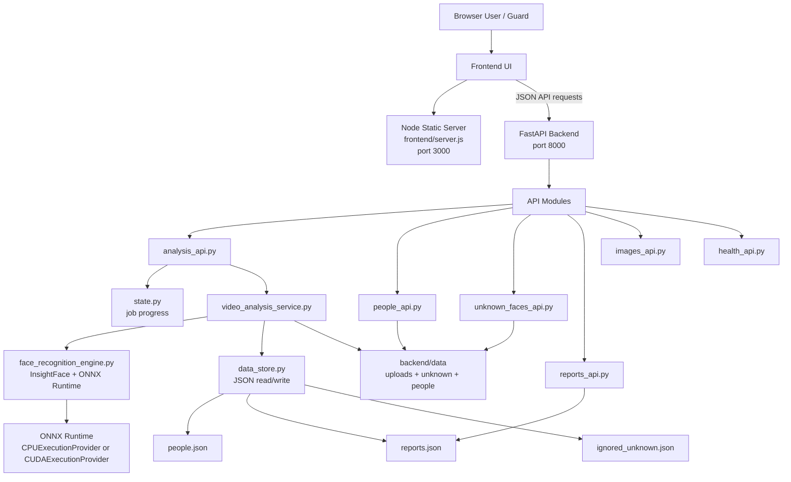
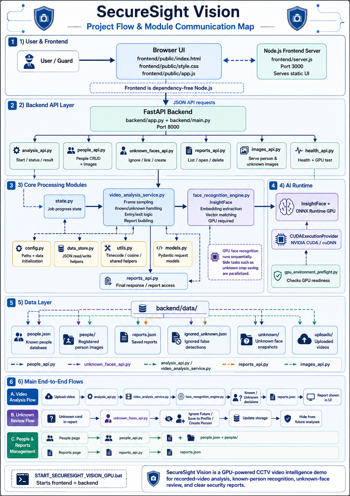

# SecureSight Vision

**SecureSight Vision** is a local AI-powered surveillance footage analysis system. It analyzes recorded CCTV videos using face recognition, identifies registered people, separates unknown detections for review, tracks entry and exit appearances, and generates security or attendance reports.

All processing is done locally on the user's machine. No cloud service is required.

---

## Repository description

Use this as the short GitHub repository description:

```text
Local AI-powered CCTV footage analysis for face recognition, unknown review, attendance-style tracking, and security reports. Supports CPU build for compatibility and GPU mode for faster analysis.
```

---

## Quick visual map

For readers who only want to understand the system quickly:

```text
User
 |
 | opens browser
 v
Frontend UI
frontend/public/index.html
frontend/public/app.js
frontend/public/style.css
 |
 | sends API requests
 v
FastAPI Backend
backend/app.py
 |
 | starts video analysis
 v
Video Analysis Service
backend/video_analysis_service.py
 |
 | detects and recognizes faces
 v
Face Recognition Engine
backend/face_recognition_engine.py
 |
 | reads and writes local data
 v
Local Data Folder
backend/data/
 |
 | creates reports
 v
Reports + Unknown Face Review
```

---

## What the project does

SecureSight Vision is designed for recorded surveillance footage. The system can:

- Analyze recorded CCTV videos locally.
- Recognize registered people.
- Track entry and exit appearances using video timecodes.
- Detect unknown faces.
- Review unknown detections.
- Ignore false detections in future analyses.
- Save unknown faces to existing known-person profiles.
- Create new people from unknown detections.
- Generate security and attendance-style reports.
- Run on CPU for wider compatibility.
- Run on NVIDIA GPU for faster analysis when supported.

---

## Stack

- **Frontend server:** Node.js, dependency-free, port `3000`
- **Frontend UI:** HTML, CSS, JavaScript in `frontend/public/`
- **Backend API:** FastAPI, port `8000`
- **AI engine:** InsightFace + ONNX Runtime
- **Runtime modes:** CPU portable mode for most devices, plus NVIDIA GPU mode for faster analysis
- **Storage:** local JSON files and images under `backend/data/`

---

## Main features

- Add, edit, and delete known people.
- Store multiple face images per person.
- Generate safer reference embeddings from uploaded images to improve recognition under side angles and CCTV lighting.
- Analyze recorded videos from the browser.
- Show analysis progress, selected device/provider, and total analyze time.
- Record known-person entry and exit timecodes.
- Count a known person again if they leave the frame and appear later.
- Review unknown faces.
- Ignore false unknown detections so similar detections are hidden in future analyses.
- Link an unknown face to an existing profile using the original video-frame embedding.
- Create a new person from an unknown face.
- Save, reopen, delete, export, and print reports.
- Use the device date for report rows.

---

## System modes

```text
CPU Mode
Works on most Windows devices.
Slower, but easier to share, submit, and build as an EXE.

GPU Mode
Uses NVIDIA GPU acceleration.
Faster, but requires an NVIDIA GPU and compatible CUDA/cuDNN dependencies.
```

Recommended usage:

```text
For public sharing or GitHub Releases:
Use the Windows CPU EXE build.

For personal demo on an NVIDIA machine:
Use GPU mode if available.
```

---

## Project flow

```text
1. Add known people
   User uploads person image
   -> people_api.py
   -> face_recognition_engine.py extracts face embedding
   -> people.json stores known person data

2. Analyze video
   User uploads recorded CCTV video
   -> analysis_api.py
   -> video_analysis_service.py reads video frames
   -> face_recognition_engine.py detects and recognizes faces
   -> system compares faces with known people and ignored unknowns

3. Generate report
   Known person detected
   -> entry / exit appearance is added to the report

   Unknown face detected
   -> saved for review
   -> user can Ignore Future, Save to Profile, or Create Person

4. Manage results
   Reports page
   -> reports_api.py
   -> user can open or delete reports
```

---

## Suggested repository structure

```text
securesight-vision/
├─ backend/
│  ├─ app.py
│  ├─ main.py
│  ├─ analysis_api.py
│  ├─ people_api.py
│  ├─ reports_api.py
│  ├─ unknown_faces_api.py
│  ├─ images_api.py
│  ├─ health_api.py
│  ├─ video_analysis_service.py
│  ├─ face_recognition_engine.py
│  ├─ data_store.py
│  ├─ config.py
│  ├─ state.py
│  ├─ utils.py
│  ├─ models.py
│  ├─ gpu_environment_preflight.py
│  ├─ cpu_requirements.txt
│  ├─ gpu_requirements.txt
│  ├─ start_cpu_backend.bat
│  ├─ start_gpu_backend.bat
│  ├─ gpu_diagnostics.bat
│  └─ data/
│     ├─ people.json
│     ├─ reports.json
│     ├─ ignored_unknown.json
│     ├─ people/
│     ├─ unknown/
│     └─ uploads/
│
├─ frontend/
│  ├─ package.json
│  ├─ server.js
│  └─ public/
│     ├─ index.html
│     ├─ app.js
│     └─ style.css
│
├─ docs/
│  └─ architecture_map.png
│
├─ START_SECURESIGHT_VISION.bat
├─ START_SECURESIGHT_VISION_CPU.bat
├─ START_SECURESIGHT_VISION_GPU.bat
├─ BUILD_WINDOWS_EXE_CPU.bat
├─ SecureSightVision.spec
├─ GPU_TROUBLESHOOTING.md
└─ README.md
```

---

## Module communication diagram



---

# How to run SecureSight Vision

There are three main ways to use the project:

```text
1. Run on CPU
2. Build Windows CPU EXE
3. Run on NVIDIA GPU
```

---

# Option 1: Run on CPU

Use this option if you want the project to work on most Windows devices.

## Requirements

Install these first:

```text
1. Windows 10 or Windows 11
2. Python 3.11 recommended
3. Node.js LTS
4. Internet connection for first-time dependency installation
```

## Steps

### 1. Download or clone the project

Using Git:

```bash
git clone https://github.com/YOUR_USERNAME/securesight-vision.git
```

Or download the project ZIP from GitHub and extract it.

### 2. Open the project folder

Example:

```text
securesight-vision/
```

### 3. Run the CPU launcher

Double-click:

```bat
START_SECURESIGHT_VISION_CPU.bat
```

Or run it from Command Prompt:

```bat
START_SECURESIGHT_VISION_CPU.bat
```

### 4. Wait for installation

The first run may take time because it installs Python and frontend dependencies.

After installation, the system should start:

```text
Backend:  http://127.0.0.1:8000
Frontend: http://127.0.0.1:3000
```

### 5. Open the browser

Usually the browser opens automatically. If not, open:

```text
http://127.0.0.1:3000
```

---

# Option 2: Build Windows CPU EXE

Use this option if you want to create a shareable Windows build.

The CPU EXE is recommended for public sharing because it does not require CUDA or an NVIDIA GPU.

## Requirements

Install:

```text
1. Windows 10 or Windows 11
2. Python 3.11
3. Internet connection during build
```

Node.js is not required after the EXE is built because the frontend is served through the packaged backend.

## Build steps

### 1. Extract or clone the project

Extract the project ZIP or clone it from GitHub.

### 2. Open the project folder

You should see:

```text
BUILD_WINDOWS_EXE_CPU.bat
SecureSightVision.spec
backend/
frontend/
```

### 3. Run the EXE builder

Double-click:

```bat
BUILD_WINDOWS_EXE_CPU.bat
```

Or run it from Command Prompt:

```bat
BUILD_WINDOWS_EXE_CPU.bat
```

### 4. Wait for the build

The build may take several minutes.

During the build, these folders may be created:

```text
.build_venv/
build/
dist/
```

### 5. Find the EXE

After a successful build, the EXE will be here:

```text
dist\SecureSightVision\SecureSightVision.exe
```

### 6. Run the EXE

Double-click:

```text
SecureSightVision.exe
```

The app should open in your browser.

---

## Important EXE distribution note

Do **not** share only this file:

```text
SecureSightVision.exe
```

You must share the entire folder:

```text
dist\SecureSightVision\
```

Correct distribution format:

```text
SecureSightVision/
├─ SecureSightVision.exe
├─ _internal/
└─ required runtime files
```

Recommended way to share:

```text
Right-click dist\SecureSightVision
-> Compress to ZIP
-> Share SecureSightVision-v1.0-Windows-CPU.zip
```

The user should extract the ZIP first, then run the EXE.

Do not run the EXE directly from inside the ZIP file.

---

# Option 3: Run on NVIDIA GPU

Use this option if you have an NVIDIA GPU and want faster video analysis.

## Requirements

```text
1. Windows 10 or Windows 11
2. NVIDIA GPU
3. Updated NVIDIA driver
4. Python 3.11 recommended
5. Node.js LTS
6. Internet connection for first-time installation
```

## Steps

### 1. Open the project folder

You should see:

```text
START_SECURESIGHT_VISION_GPU.bat
backend/
frontend/
```

### 2. Run the GPU launcher

Double-click:

```bat
START_SECURESIGHT_VISION_GPU.bat
```

Or from Command Prompt:

```bat
START_SECURESIGHT_VISION_GPU.bat
```

### 3. Wait for installation

The script installs GPU-related dependencies.

This may take longer than CPU mode.

### 4. Check GPU preflight

The GPU launcher checks whether the required GPU runtime is available.

Useful URLs after startup:

```text
http://127.0.0.1:8000/health
http://127.0.0.1:8000/face/test
```

Expected `/face/test` result for GPU mode:

```json
{
  "device": "GPU",
  "ctx_id": 0,
  "selected_providers": ["CUDAExecutionProvider", "CPUExecutionProvider"]
}
```

### 5. Open the browser

Open:

```text
http://127.0.0.1:3000
```

---

# Which mode should I use?

```text
Use CPU mode if:
- You want the project to run on most devices.
- You want to submit or share it.
- You do not know if the target machine has an NVIDIA GPU.
- You want fewer setup problems.

Use GPU mode if:
- You are running it on your own NVIDIA machine.
- You want faster analysis.
- You already have compatible NVIDIA drivers.
```

Recommended:

```text
For public sharing / GitHub Release:
Use CPU EXE build.

For personal demo on your machine:
Use GPU mode if available.
```

---

# One-page quick guide

For people who do not want to read everything:

```text
SecureSight Vision

What it does:
Analyzes recorded CCTV videos locally using face recognition.
It recognizes known people, reviews unknown faces, tracks entry/exit appearances, and creates reports.

Fastest way to run:
1. Download project
2. Extract ZIP
3. For most devices:
   Run START_SECURESIGHT_VISION_CPU.bat

For NVIDIA GPU:
Run START_SECURESIGHT_VISION_GPU.bat

To build EXE:
Run BUILD_WINDOWS_EXE_CPU.bat
Then use:
dist\SecureSightVision\SecureSightVision.exe

To share EXE:
Zip the whole folder:
dist\SecureSightVision\
Do not share the EXE alone.
```

---

## Analysis flow

1. The browser uploads a recorded CCTV video to `/api/analyze/start`.
2. The backend saves the file in `backend/data/uploads/` and creates a job in `state.py`.
3. `video_analysis_service.py` runs analysis in a background thread.
4. `face_recognition_engine.py` loads InsightFace and ONNX Runtime.
5. The analyzer samples frames based on the selected `sample_every` value.
6. Each sampled frame is processed for face detection and recognition.
7. Known people are matched against a vectorized embedding index.
8. If a known person leaves the frame and appears after the re-entry gap, a new detection event is created.
9. Unknown detections are checked against `ignored_unknown.json` and against unknowns already shown in the same report.
10. Unknown crop saving runs in a small side-worker pool because it does not need the recognition model.
11. The backend records `analysis_seconds`, `analysis_time`, known entries/exits, unknown cards, and recommendations.
12. The final report is saved in `backend/data/reports.json` and returned to the UI.

---

## Recognition notes

For best results:

- Add more than one image per person when possible: front, left side, and right side.
- Use clear face images with enough resolution.
- The system creates mirrored and brightness-adjusted embeddings from uploaded face images.
- Borderline matches are accepted only when the best match is clearly better than the second-best match.
- Unknown review actions use the original detection embedding from the video frame, not only the cropped snapshot. This makes **Save to Profile**, **Create Person**, and **Ignore Future** more reliable.

---

## Parallelization notes

The GPU recognition path is intentionally sequential because the InsightFace/ONNXRuntime session owns the CUDA context. Parallelization is used only for side work that does not call the model, such as saving unknown-face crops and preparing report data. This improves responsiveness without risking GPU session conflicts.

The CPU EXE build uses `FACE_PROVIDER=cpu` and `FACE_CPU_WORKERS=auto`. This enables safe frame-level parallel scanning on CPU while keeping report decisions, entry/exit logic, and unknown-face deduplication in chronological order.

---

## Report fields

The report includes:

- Unique known people count
- Known detection count
- Repeated detection count
- Unknown face count
- Analysis time
- Device/provider information
- Guard recommendations
- Known-person table with device date, entry, exit, confidence
- Unknown-face review cards with Save to Profile, Create Person, and Ignore Future actions

Known-person rows include:

- Name
- Employee/student ID
- Role
- Department
- Device date
- Entry timecode
- Exit timecode
- Confidence

The report intentionally does not show a visit-number column.

---

## Data location

```text
backend/data/people.json
backend/data/reports.json
backend/data/ignored_unknown.json
backend/data/people/
backend/data/unknown/
backend/data/uploads/
```

These files and folders are included in the project and are recreated automatically by `config.ensure_data_store()` if deleted.

---

# Common issues

## CPU build says onnxruntime / scipy / matplotlib error

Try this:

```text
1. Delete .build_venv
2. Delete build
3. Delete dist
4. Run BUILD_WINDOWS_EXE_CPU.bat again
```

If ONNXRuntime DLL fails, install:

```text
Microsoft Visual C++ Redistributable 2015-2022 x64
```

Then rebuild.

---

## GPU mode fails

Try:

```text
1. Delete backend\.venv
2. Run START_SECURESIGHT_VISION_GPU.bat again
3. Let pip finish installing all packages
```

If it still fails, use CPU mode:

```bat
START_SECURESIGHT_VISION_CPU.bat
```

---

## Missing CUDA DLLs

If the GPU preflight says `cusolver64_11.dll` or `cusparse64_12.dll` is missing, the CUDA runtime wheels did not finish installing or the environment was created before the dependency list changed.

The required packages are listed in `backend/gpu_requirements.txt`:

```text
nvidia-cusolver-cu12
nvidia-cusparse-cu12
```

If the error remains, delete `backend\.venv` and run `START_SECURESIGHT_VISION_GPU.bat` again.

You can also run:

```bat
backend\gpu_diagnostics.bat
```

See `GPU_TROUBLESHOOTING.md` for cuDNN, ONNXRuntime, and PyTorch DLL conflict notes.

---

## App opens but analysis is slow

CPU mode is slower by nature.

Try running the EXE from Command Prompt with fewer CPU workers:

```bat
set FACE_CPU_WORKERS=2
SecureSightVision.exe
```

Or:

```bat
set FACE_CPU_WORKERS=1
SecureSightVision.exe
```

Use fewer workers on weak laptops.

---

# What to upload to GitHub

Upload the project source code, but do not upload generated build folders.

Do not upload:

```text
.venv/
.build_venv/
build/
dist/
__pycache__/
*.pyc
backend/data/uploads/*
backend/data/people/*
backend/data/unknown/*
real CCTV videos
real face images
private reports
```

Upload the EXE only as a GitHub Release ZIP:

```text
SecureSightVision-v1.0-Windows-CPU.zip
```

The ZIP should contain:

```text
SecureSightVision/
├─ SecureSightVision.exe
├─ _internal/
└─ all packaged runtime files
```

---

# Suggested GitHub Release text

```markdown
# SecureSight Vision v1.0 - Windows CPU Demo

This release contains the Windows CPU build of SecureSight Vision.

## How to run

1. Download `SecureSightVision-v1.0-Windows-CPU.zip`
2. Extract the ZIP
3. Open the extracted folder
4. Run `SecureSightVision.exe`

Do not run the EXE directly from inside the ZIP.

## Notes

- This is the CPU version for better compatibility.
- No NVIDIA GPU is required.
- Processing speed depends on CPU performance.
- All processing is local.
```

---

# Privacy note

This project is designed to run locally. Do not upload real people images, private CCTV footage, or personal reports to a public repository.

Before publishing the project, make sure these folders are empty or ignored:

```text
backend/data/uploads/
backend/data/people/
backend/data/unknown/
```

The JSON files can remain as empty arrays:

```json
[]
```

---

## Development notes

- Edit frontend files in `frontend/public/`.
- Restart the Node frontend window after frontend changes.
- Restart the backend launcher after backend changes.
- Do not commit `.venv`, `.build_venv`, `build`, `dist`, `__pycache__`, or `.pyc` files.

---

## Architecture map


