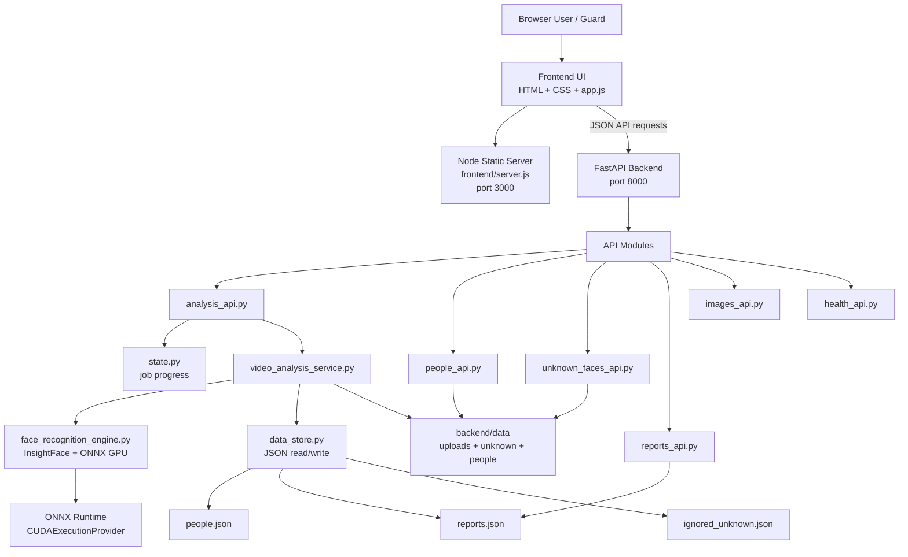

# SecureSight Vision

**SecureSight Vision** is a GPU-powered CCTV video intelligence demo. It analyzes recorded surveillance videos, recognizes registered people, separates unknown detections for review, supports ignore/link/create workflows, and generates clear security reports with entry/exit timecodes.

## Stack

- **Frontend server:** Node.js, dependency-free, port `3000`
- **Frontend UI:** HTML, CSS, JavaScript in `frontend/public/`
- **Backend API:** FastAPI, port `8000`
- **AI engine:** InsightFace + ONNX Runtime GPU
- **Runtime modes:** CPU portable mode for most devices, plus NVIDIA GPU mode for faster analysis
- **Storage:** local JSON files and images under `backend/data/`

## Main Features

- Add, edit, and delete known people.
- Store multiple face images per person.
- Generate safer reference embeddings from uploaded images to improve recognition under side angles and CCTV lighting.
- Analyze recorded videos from the browser.
- Show analysis progress, GPU device, and total analyze time.
- Record known-person entry and exit timecodes.
- Count a known person again if they leave the frame and appear later.
- Review unknown faces.
- Ignore false unknown detections so similar detections are hidden in future analyses.
- Link an unknown face to an existing profile using the original video-frame embedding.
- Create a new person from an unknown face.
- Save, reopen, delete, export, and print reports.
- Use the device date for report rows.

## Run

Recommended delivery launcher:

```bat
START_SECURESIGHT_VISION.bat
```

This auto launcher starts GPU mode when NVIDIA tools are available, otherwise it starts portable CPU mode.

Most compatible launcher:

```bat
START_SECURESIGHT_VISION_CPU.bat
```

Fast NVIDIA launcher:

```bat
START_SECURESIGHT_VISION_GPU.bat
```

The launcher opens two command windows:

```text
Backend API:  http://127.0.0.1:8000
Frontend UI:  http://127.0.0.1:3000
```

The frontend does **not** run `npm install`. It uses only built-in Node.js modules.


## Delivery / Compatibility Build

This package includes two backend environments so it can be demonstrated on more machines:

- **CPU mode** uses `onnxruntime` and creates `backend/.venv-cpu`. It works on most Windows devices with Python + Node.js, but analysis is slower.
- **GPU mode** uses `onnxruntime-gpu` and creates `backend/.venv`. It is faster, but requires NVIDIA driver and compatible CUDA/cuDNN runtime.

Use `START_SECURESIGHT_VISION_CPU.bat` when submitting or presenting on an unknown device. Use `START_SECURESIGHT_VISION_GPU.bat` on your own NVIDIA machine.

See `SUBMISSION_README.md` for a short handover guide.

## GPU Requirement

This build is designed for an NVIDIA GPU. The backend sets `FACE_PROVIDER=cuda` and runs a preflight check before starting.

Expected `/face/test` result:

```json
{
  "device": "GPU",
  "ctx_id": 0,
  "selected_providers": ["CUDAExecutionProvider", "CPUExecutionProvider"]
}
```

Useful URLs:

```text
http://127.0.0.1:8000/health
http://127.0.0.1:8000/face/test
```

If CUDA/cuDNN DLLs are missing, run:

```bat
backend\gpu_diagnostics.bat
```

See `GPU_TROUBLESHOOTING.md` for cuDNN, ONNXRuntime, and PyTorch DLL conflict notes.

## Project Structure

```text
securesight-vision/
├─ START_SECURESIGHT_VISION.bat           auto launcher, chooses GPU if available otherwise CPU
├─ START_SECURESIGHT_VISION_CPU.bat       portable CPU launcher for most devices
├─ START_SECURESIGHT_VISION_GPU.bat       NVIDIA GPU launcher for faster analysis
├─ README.md                              project overview and architecture
├─ GPU_TROUBLESHOOTING.md                 GPU setup and troubleshooting notes
├─ frontend/
│  ├─ package.json                        frontend metadata, no dependencies
│  ├─ server.js                           dependency-free Node static server
│  └─ public/
│     ├─ index.html                       app layout
│     ├─ style.css                        responsive UI styling
│     └─ app.js                           browser logic, API calls, report rendering
└─ backend/
   ├─ data/
   │  ├─ people.json                      known people database
   │  ├─ reports.json                     saved reports
   │  ├─ ignored_unknown.json             ignored false-detection embeddings
   │  ├─ people/                          registered person images
   │  ├─ unknown/                         unknown snapshots
   │  └─ uploads/                         uploaded videos
   ├─ main.py                             Uvicorn entry point
   ├─ app.py                              FastAPI app factory and route wiring
   ├─ config.py                           paths and data-folder initialization
   ├─ data_store.py                       JSON read/write helpers
   ├─ state.py                            in-memory job progress
   ├─ utils.py                            shared upload, URL, timecode, cosine helpers
   ├─ models.py                           Pydantic request models
   ├─ face_recognition_engine.py          InsightFace loading, GPU checks, embeddings, matching
   ├─ video_analysis_service.py           video sampling, recognition, re-entry logic, report building
   ├─ analysis_api.py                     analysis start/status/result routes
   ├─ people_api.py                       people CRUD and image management routes
   ├─ unknown_faces_api.py                unknown review, ignore, link, create routes
   ├─ reports_api.py                      saved report list/delete routes
   ├─ images_api.py                       serves person and unknown images
   ├─ health_api.py                       health and face-engine test routes
   ├─ gpu_environment_preflight.py        validates ONNXRuntime GPU readiness
   ├─ cpu_requirements.txt                Python CPU dependency list for portable mode
   ├─ gpu_requirements.txt                Python GPU dependency list
   ├─ start_cpu_backend.bat               portable backend setup/start script
   ├─ start_gpu_backend.bat               GPU backend setup/start script
   └─ gpu_diagnostics.bat                 CUDA/cuDNN diagnostic script
```

## Module Communication Diagram



## Analysis Flow

1. The browser uploads a recorded CCTV video to `/api/analyze/start`.
2. The backend saves the file in `backend/data/uploads/` and creates a job in `state.py`.
3. `video_analysis_service.py` runs analysis in a background thread.
4. `face_recognition_engine.py` loads InsightFace once and requires ONNXRuntime CUDA.
5. The analyzer samples frames based on the selected `sample_every` value.
6. Each sampled frame is processed by GPU face detection and recognition.
7. Known people are matched against a vectorized embedding index.
8. If a known person leaves the frame and appears after the re-entry gap, a new detection event is created.
9. Unknown detections are checked against `ignored_unknown.json` and against unknowns already shown in the same report.
10. Unknown crop saving runs in a small side-worker pool because it does not need the GPU model.
11. The backend records `analysis_seconds`, `analysis_time`, known entries/exits, unknown cards, and recommendations.
12. The final report is saved in `backend/data/reports.json` and returned to the UI.

## Recognition Notes

For best results:

- Add more than one image per person when possible: front, left side, and right side.
- Use clear face images with enough resolution.
- The system creates mirrored and brightness-adjusted embeddings from uploaded face images.
- Borderline matches are accepted only when the best match is clearly better than the second-best match.
- Unknown review actions use the original detection embedding from the video frame, not only the cropped snapshot. This makes **Save to Profile**, **Create Person**, and **Ignore Future** more reliable.

## Parallelization Notes

The GPU recognition path is intentionally sequential because the InsightFace/ONNXRuntime session owns the CUDA context. Parallelization is used only for side work that does not call the model, such as saving unknown-face crops and preparing report data. This improves responsiveness without risking GPU session conflicts.

## Report Fields

The report includes:

- unique known people count
- known detection count
- repeated detection count
- unknown face count
- analysis time
- GPU device/provider information
- guard recommendations
- known-person table with device date, entry, exit, confidence
- unknown-face review cards with Save to Profile, Create Person, and Ignore Future actions

Known-person rows include:

- name
- employee/student ID
- role
- department
- device date
- entry timecode
- exit timecode
- confidence

The report intentionally does not show a visit-number column.

## Data Location

```text
backend/data/people.json
backend/data/reports.json
backend/data/ignored_unknown.json
backend/data/people/
backend/data/unknown/
backend/data/uploads/
```

These files and folders are included in the project and are recreated automatically by `config.ensure_data_store()` if deleted.

## Development Notes

- Edit frontend files in `frontend/public/`.
- Restart the Node frontend window after frontend changes.
- Restart `backend/start_gpu_backend.bat` after backend changes.
- Do not commit `.venv`, `__pycache__`, or `.pyc` files.

## Missing CUDA DLLs

If the GPU preflight says `cusolver64_11.dll` or `cusparse64_12.dll` is missing, the CUDA runtime wheels did not finish installing or the environment was created before the dependency list changed.

The required packages are listed in `backend/gpu_requirements.txt`:

```text
nvidia-cusolver-cu12
nvidia-cusparse-cu12
```

The launcher uses a dependency-version stamp and refreshes packages when the requirement version changes. If the error remains, delete `backend\.venv` and run `START_SECURESIGHT_VISION_GPU.bat` again.

## Windows EXE Build

A CPU-based EXE build path is included for submission.

Run on Windows:

```bat
BUILD_WINDOWS_EXE_CPU.bat
```

The output will be:

```text
dist/SecureSightVision/SecureSightVision.exe
```

For submission, zip and submit the full `dist/SecureSightVision/` folder, not only the EXE file. The EXE build serves the frontend from the FastAPI app, so Node.js is not required at runtime for the built EXE.

GPU EXE packaging is not recommended for general delivery because CUDA/cuDNN packaging is machine-sensitive. Use the GPU BAT launcher for your own NVIDIA machine.


## CPU EXE Build with Parallel Scan

For submission on Windows, use the CPU EXE builder:

```bat
BUILD_WINDOWS_EXE_CPU.bat
```

The output is created at:

```text
dist\SecureSightVision\SecureSightVision.exe
```

Submit the whole folder `dist\SecureSightVision\`, not only the `.exe` file.

The CPU EXE build uses `FACE_PROVIDER=cpu` and `FACE_CPU_WORKERS=auto`. This enables safe frame-level parallel scanning on CPU while keeping report decisions, entry/exit logic, and unknown-face deduplication in chronological order.

See `CPU_EXE_BUILD_STEPS_AR.md` for Arabic build instructions.
